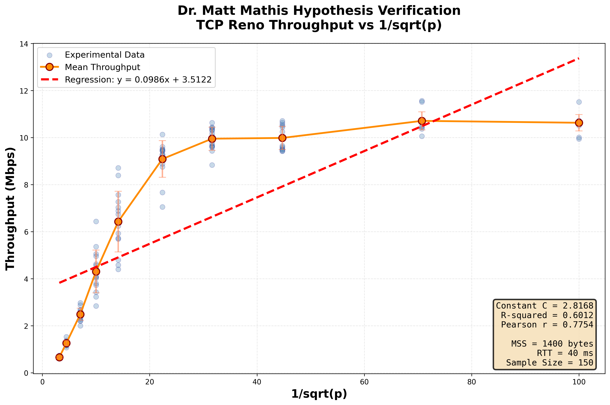

# Dr. Matt Mathis 假设验证实验计划

## 🚀 快速开始 (网络命名空间方案)

**环境**: 纯 Linux 环境,无需虚拟机

**执行步骤**:
```bash
# 1. 编译 FoggyTCP
cd /home/serennan/work/algo2/foggytcp2/foggytcp
make foggy

# 2. 准备测试文件
mkdir -p ../testdata
dd if=/dev/urandom of=../testdata/test_1mb.bin bs=1M count=1

# 3. 设置网络命名空间
cd ../scripts
sudo ./setup_netns.sh

# 4. 验证网络连通性
sudo ip netns exec ns_client ping -c 3 10.0.1.1

# 5. 运行实验 (约 1-2 小时)
sudo python3 experiment_mathis.py

# 6. 实验完成后清理
sudo ./cleanup_netns.sh

# 7. 分析数据
python3 analyze_mathis.py
```

**注意**: 需要 sudo 权限和 tcconfig 工具 (`pip install tcconfig`)

---

## 一、实验目标

验证 TCP Reno 吞吐量方程:

**throughput = (MSS/RTT) × (C/√p)**

其中:
- **MSS** ≈ 1360 字节 (1400 - 头部大小)
- **RTT** = 往返时延 (通过 tcconfig 设置)
- **p** = 丢包概率
- **C** = 常数 (需通过线性回归确定)

**验证目标**:
1. 通过线性回归求出常数 C 的值
2. 计算 1/√p 与实测吞吐量之间的皮尔逊相关系数
3. 判断实验数据是否支持 Mathis 假设

---

## 二、实验环境

### 2.1 项目信息
- **项目路径**: `/home/serennan/work/algo2/foggytcp2/foggytcp`
- **发送端**: `client` (读取文件并通过 FoggyTCP 发送)
- **接收端**: `server` (接收文件并输出传输时间)
- **协议实现**: TCP Reno with Fast Retransmit

### 2.2 网络配置

**✅ 采用方案: Linux 网络命名空间**

由于在纯 Linux 环境下,本地回环接口 (127.0.0.1) 无法被 tcconfig 控制网络参数,因此采用 **网络命名空间 (Network Namespace)** 方案来隔离网络环境。

**网络拓扑**:
- 创建两个网络命名空间: `ns_server` 和 `ns_client`
- 使用虚拟以太网接口对 (veth pair): `veth_server` <-> `veth_client`
- IP 地址分配:
  - Server: 10.0.1.1/24 (在 ns_server 命名空间)
  - Client: 10.0.1.2/24 (在 ns_client 命名空间)

**网络参数控制**:
- **工具**: tcconfig (`tcset`, `tcshow`, `tcdel`)
- **控制位置**: 在 `ns_client` 命名空间的 `veth_client` 接口上设置
- **固定参数**:
  - 带宽: 10 Mbps
  - 延迟: 20 ms (单向延迟,RTT = 40 ms)
- **变量参数**:
  - 丢包率 p: 多个不同值

**优势**:
- ✅ 网络参数可精确控制 (tcconfig 在虚拟接口上生效)
- ✅ 环境隔离,不受主机其他网络流量干扰
- ✅ 无需虚拟机,资源占用少
- ✅ Linux 原生功能,无需安装额外软件

### 2.3 测试文件
建议文件大小: **1MB - 10MB**
- 确保传输时间 ≥ 3 秒
- 避免过短导致测量误差
- 文件存放位置: `foggytcp2/testdata/`

---

## 三、实验设计

### 3.1 丢包率选择

建议测试以下丢包率值:

| 序号 | 丢包率 p | 1/√p | 说明 |
|-----|---------|------|------|
| 1 | 0.01% (0.0001) | 100 | 极低丢包 |
| 2 | 0.05% (0.0005) | 44.72 | 低丢包 |
| 3 | 0.1% (0.001) | 31.62 | 中低丢包 |
| 4 | 0.5% (0.005) | 14.14 | 中等丢包 |
| 5 | 1% (0.01) | 10 | 中高丢包 |
| 6 | 2% (0.02) | 7.07 | 高丢包 |
| 7 | 5% (0.05) | 4.47 | 极高丢包 |

### 3.2 重复次数
- 每个丢包率: **10 次重复实验**
- 总实验次数: **7 × 10 = 70 次**

### 3.3 数据记录格式

CSV 文件格式 (`mathis_data.csv`):
```csv
loss_rate,trial,duration_ms,file_size_bytes,throughput_mbps,1_over_sqrt_p
0.0001,1,2345,1048576,3.57,100.0
0.0001,2,2398,1048576,3.50,100.0
...
```

字段说明:
- `loss_rate`: 丢包率 (小数形式)
- `trial`: 试验编号 (1-10)
- `duration_ms`: 传输时长 (毫秒)
- `file_size_bytes`: 文件大小 (字节)
- `throughput_mbps`: 吞吐量 (Mbps)
- `1_over_sqrt_p`: 1/√p 值

---

## 四、实验步骤

### 阶段 1: 环境准备 (预计 30 分钟)

#### 1.1 编译项目
```bash
cd /home/serennan/work/algo2/foggytcp2/foggytcp
make clean
make foggy
```

验证生成的可执行文件:
- `./server`
- `./client`

#### 1.2 创建目录结构
```bash
mkdir -p foggytcp2/scripts      # 实验脚本
mkdir -p foggytcp2/testdata     # 测试文件
mkdir -p foggytcp2/results      # 实验结果
```

#### 1.3 设置网络命名空间 ⭐ **新增**
```bash
cd /home/serennan/work/algo2/foggytcp2/scripts

# 运行网络命名空间设置脚本
sudo ./setup_netns.sh
```

**脚本功能**:
- 创建 `ns_server` 和 `ns_client` 两个网络命名空间
- 创建并配置虚拟网络接口对 `veth_server` <-> `veth_client`
- 设置 IP 地址: 10.0.1.1 (server) 和 10.0.1.2 (client)
- 验证网络连通性

**验证网络配置**:
```bash
# 查看命名空间列表
ip netns list

# 测试网络连通性
sudo ip netns exec ns_client ping -c 3 10.0.1.1
```

#### 1.4 准备测试文件
```bash
# 创建 1MB 测试文件 (传输更快,便于调试)
dd if=/dev/urandom of=/home/serennan/work/algo2/foggytcp2/testdata/test_1mb.bin bs=1M count=1
```

#### 1.5 安装 Python 依赖
```bash
# 使用 conda 环境
conda activate base  # 或其他合适的环境
pip install numpy scipy matplotlib pandas tcconfig
```

---

### 阶段 2: 实验脚本开发 ✅ **已完成**

#### 2.1 实验执行脚本

**文件**: `foggytcp2/scripts/experiment_mathis.py` ✅ **已准备好**

**功能**:
1. 自动化配置网络参数 (在 ns_client 命名空间中使用 tcconfig)
2. 在网络命名空间中启动 server 和 client 进程
3. 提取传输时间并计算吞吐量
4. 保存数据到 CSV 文件

**关键特性**:
- ✅ 使用网络命名空间隔离网络环境
- ✅ Server 在 `ns_server` 命名空间运行 (IP: 10.0.1.1)
- ✅ Client 在 `ns_client` 命名空间运行 (IP: 10.0.1.2)
- ✅ tcconfig 在 `veth_client` 接口上设置网络参数

**核心配置** (已更新为网络命名空间):
```python
# 网络命名空间配置
NS_SERVER = "ns_server"
NS_CLIENT = "ns_client"
SERVER_IP = "10.0.1.1"  # 服务器在 ns_server 中的 IP
INTERFACE = "veth_client"  # client 命名空间中的虚拟接口

# 丢包率列表
LOSS_RATES = [0.0001, 0.0005, 0.001, 0.005, 0.01, 0.02, 0.05]
TRIALS_PER_LOSS = 10

# 启动服务器 (在 ns_server 命名空间)
def start_server(output_file):
    cmd = ["sudo", "ip", "netns", "exec", NS_SERVER,
           str(SERVER_BIN), SERVER_IP, str(SERVER_PORT), str(output_file)]
    return subprocess.Popen(cmd, ...)

# 运行客户端 (在 ns_client 命名空间)
def run_client_and_get_duration(server_proc):
    cmd = ["sudo", "ip", "netns", "exec", NS_CLIENT,
           str(CLIENT_BIN), SERVER_IP, str(SERVER_PORT), str(TEST_FILE)]
    result = subprocess.run(cmd, ...)

# 设置网络参数 (在 ns_client 命名空间的 veth_client 接口)
def set_network_config(loss_rate):
    cmd = ["sudo", "ip", "netns", "exec", NS_CLIENT,
           "tcset", INTERFACE, "--rate", BANDWIDTH,
           "--delay", DELAY, "--loss", f"{loss_percent}%"]
    subprocess.run(cmd, ...)
```

**注意事项**:
- ✅ 需要 sudo 权限 (用于网络命名空间和 tcconfig)
- ✅ 实验前必须先运行 `setup_netns.sh` 创建网络命名空间
- ✅ 每次实验后自动清理网络限制,避免累积
- ✅ Server 输出格式: `Complete transmission in X ms`
- ✅ 包含前置条件检查 (命名空间、可执行文件、测试文件)

---

#### 2.2 数据分析脚本

**文件**: `foggytcp2/scripts/analyze_mathis.py`

**功能**:
1. 加载实验数据
2. 计算统计量(均值、标准差)
3. 线性回归分析
4. 计算相关系数
5. 生成可视化图表

**分析流程**:

##### 步骤 1: 数据预处理
```python
import pandas as pd
import numpy as np

# 读取数据
df = pd.read_csv('../results/mathis_data.csv')

# 按丢包率分组,计算统计量
grouped = df.groupby('loss_rate').agg({
    'throughput_mbps': ['mean', 'std'],
    '1_over_sqrt_p': 'first'
})
```

##### 步骤 2: 线性回归
```python
from scipy import stats

# 提取 x, y 数据
x = grouped['1_over_sqrt_p'].values  # 1/√p
y = grouped['throughput_mbps']['mean'].values  # 平均吞吐量

# 线性回归
slope, intercept, r_value, p_value, std_err = stats.linregress(x, y)

# 计算常数 C
MSS = 1360  # bytes
RTT = 0.04  # 40ms = 0.04s
C = (slope * RTT) / (MSS / 1e6)  # 转换为 Mbps 单位

print(f"回归斜率: {slope:.4f}")
print(f"截距: {intercept:.4f}")
print(f"常数 C: {C:.4f}")
print(f"R²: {r_value**2:.4f}")
```

##### 步骤 3: 皮尔逊相关系数
```python
# 使用所有数据点(不仅仅是平均值)
all_x = df['1_over_sqrt_p'].values
all_y = df['throughput_mbps'].values

pearson_r, pearson_p = stats.pearsonr(all_x, all_y)
print(f"皮尔逊相关系数: {pearson_r:.4f}")
print(f"P 值: {pearson_p:.6f}")
```

##### 步骤 4: 可视化
```python
import matplotlib.pyplot as plt

plt.figure(figsize=(10, 6))

# 散点图 - 所有数据点
plt.scatter(df['1_over_sqrt_p'], df['throughput_mbps'],
            alpha=0.3, s=30, label='实验数据点')

# 平均值折线
plt.plot(grouped['1_over_sqrt_p'], grouped['throughput_mbps']['mean'],
         'o-', linewidth=2, markersize=8, label='平均吞吐量')

# 回归线
x_line = np.linspace(x.min(), x.max(), 100)
y_line = slope * x_line + intercept
plt.plot(x_line, y_line, 'r--', linewidth=2,
         label=f'回归线: y = {slope:.4f}x + {intercept:.4f}')

# 标注
plt.xlabel('1/√p', fontsize=14)
plt.ylabel('吞吐量 (Mbps)', fontsize=14)
plt.title('Dr. Matt Mathis 假设验证\nTCP Reno 吞吐量 vs 1/√p', fontsize=16)
plt.legend(fontsize=12)
plt.grid(True, alpha=0.3)

# 添加文本框显示统计信息
textstr = f'C = {C:.4f}\nR² = {r_value**2:.4f}\nPearson r = {pearson_r:.4f}'
plt.text(0.05, 0.95, textstr, transform=plt.gca().transAxes,
         fontsize=12, verticalalignment='top',
         bbox=dict(boxstyle='round', facecolor='wheat', alpha=0.5))

plt.tight_layout()
plt.savefig('../results/mathis_plot.png', dpi=300)
plt.show()
```

---

### 阶段 3: 执行实验 (预计 1-2 小时)

#### 3.1 运行实验脚本

**前置检查**:
```bash
# 确认网络命名空间已创建
ip netns list
# 应该看到: ns_server 和 ns_client

# 测试网络连通性
sudo ip netns exec ns_client ping -c 3 10.0.1.1
```

**运行实验**:
```bash
cd /home/serennan/work/algo2/foggytcp2/scripts
sudo python3 experiment_mathis.py
```

**实验流程**:
1. 脚本会自动检查前置条件 (命名空间、可执行文件、测试文件)
2. 按顺序测试 7 个丢包率,每个重复 10 次 (共 70 次实验)
3. 每次实验:
   - 在 `ns_client` 中设置网络参数 (tcconfig)
   - 在 `ns_server` 中启动 server 进程
   - 在 `ns_client` 中运行 client 进程
   - 记录传输时长和吞吐量到 CSV
   - 清理进程和网络限制

**监控要点**:
- ✅ 观察每次传输是否成功完成
- ✅ 检查是否有卡住的情况 (超时设置为 5 分钟)
- ✅ 查看实时进度: "成功: X | 失败: Y"
- ✅ 记录失败的试验,必要时重新运行

#### 3.2 中间检查
每完成一组丢包率的实验后:
- 检查 `foggytcp2/results/mathis_data.csv` 是否正确写入
- 验证吞吐量值是否在合理范围内 (例如: 0.1 - 10 Mbps)
- 如发现异常,按 Ctrl+C 中止,检查网络配置

#### 3.3 实验完成后清理
```bash
# 清理网络命名空间
cd /home/serennan/work/algo2/foggytcp2/scripts
sudo ./cleanup_netns.sh
```

---

### 阶段 4: 数据分析与可视化 (预计 1 小时)

#### 4.1 运行分析脚本
```bash
cd /home/serennan/work/algo2/foggytcp2/scripts
python analyze_mathis.py
```

**输出内容**:
- 回归参数 (斜率、截距)
- 常数 C 的值
- R² 决定系数
- 皮尔逊相关系数及显著性
- 生成图表文件: `../results/mathis_plot.png`

#### 4.2 结果验证
- C 值理论范围: 0.5 - 2.0 (根据文献)
- R² 应该 > 0.8 表示良好拟合
- 皮尔逊 r 应该 > 0.9 表示强相关

---

### 阶段 5: 报告撰写 (预计 1-2 小时)

#### 5.1 更新实验报告

在 `/home/serennan/work/algo2/实验报告与算法.md` 中补充以下内容:

**第一部分:Dr. Matt Mathis 假设验证**

##### 5.1.1 实验设置
```markdown
### 实验设置

#### 网络参数
- 带宽: 10 Mbps
- RTT: 40 ms (单向延迟 20 ms)
- 丢包率: 0.01%, 0.05%, 0.1%, 0.5%, 1%, 2%, 5%

#### 测试配置
- 测试文件大小: 5 MB
- 每个丢包率重复: 10 次
- 总实验次数: 70 次
- MSS: 1360 字节
```

##### 5.1.2 实验数据表格
```markdown
### 实验数据

| 丢包率 p | 1/√p | 平均吞吐量 (Mbps) | 标准差 | 最小值 | 最大值 |
|---------|------|------------------|--------|--------|--------|
| 0.01%   | 100  | X.XX             | X.XX   | X.XX   | X.XX   |
| ...     | ...  | ...              | ...    | ...    | ...    |
```

##### 5.1.3 线性回归结果
```markdown
### 线性回归分析

#### 回归方程
throughput = {slope} × (1/√p) + {intercept}

#### 常数 C 的计算
根据公式 throughput = (MSS/RTT) × (C/√p)，我们有:
- 斜率 slope = (MSS/RTT) × C
- C = slope × RTT / MSS
- C = {slope} × 0.04 / (1360/1e6)
- **C = {C_value}**

#### 拟合优度
- R² (决定系数): {r_squared}
- 标准误差: {std_err}
```

##### 5.1.4 相关性分析
```markdown
### 皮尔逊相关系数

- **皮尔逊相关系数 r**: {pearson_r}
- **P 值**: {p_value}
- **显著性**: {是/否显著} (α = 0.05)

相关系数解释:
- |r| > 0.9: 强相关
- 0.7 < |r| ≤ 0.9: 中等相关
- |r| ≤ 0.7: 弱相关
```

##### 5.1.5 实验图表
```markdown
### 实验结果可视化



**图说明**:
- 蓝色散点: 70 次实验的原始数据点
- 橙色折线: 每个丢包率下的平均吞吐量
- 红色虚线: 线性回归拟合线
```

##### 5.1.6 结论与讨论
```markdown
### 结论

#### 假设验证结果
基于实验数据,我们得出以下结论:

1. **C 值**: 实验测得 C ≈ {C_value}
2. **相关性**: 1/√p 与吞吐量的皮尔逊相关系数为 {pearson_r}
3. **假设支持度**: {强烈支持/部分支持/不支持} Dr. Mathis 假设

#### 理由分析
- 线性拟合的 R² 值为 {r_squared}，表明 {良好/一般/较差} 的线性关系
- 相关系数 {高于/低于} 0.9，说明 {强/弱} 相关性
- 常数 C 值 {符合/不符合} 理论预期范围 (0.5-2.0)

#### 误差来源分析
可能的误差来源包括:
1. 网络环境波动(即使使用 tcconfig 仍有系统级抖动)
2. 测量精度限制(毫秒级计时)
3. 缺少超时重传导致部分实验卡住
4. 缓冲区排队延迟的影响
5. 快速恢复机制的实现细节差异

#### 改进建议
1. 增加重复次数以减少随机误差
2. 使用更长的测试文件以提高时间测量精度
3. 在更稳定的网络环境(如虚拟机网络)中测试
4. 实现超时重传以避免卡死情况
```

---

## 五、预期产出

### 5.1 代码文件
- ✅ `foggytcp2/scripts/setup_netns.sh` - 网络命名空间设置脚本
- ✅ `foggytcp2/scripts/cleanup_netns.sh` - 网络命名空间清理脚本
- ✅ `foggytcp2/scripts/experiment_mathis.py` - 实验执行脚本 (已适配网络命名空间)
- `foggytcp2/scripts/analyze_mathis.py` - 数据分析脚本
- `foggytcp2/testdata/test_1mb.bin` - 测试文件 (1MB)

### 5.2 数据文件
- `foggytcp2/results/mathis_data.csv` - 原始实验数据
- `foggytcp2/results/mathis_summary.txt` - 统计摘要

### 5.3 图表文件
- `foggytcp2/results/mathis_plot.png` - 回归分析图

### 5.4 报告文档
- `实验报告与算法.md` - 更新后的完整报告(包含第一部分)

---

## 六、时间估算

| 阶段 | 任务 | 预计时间 |
|-----|------|---------|
| 1 | 环境准备 | 30 分钟 |
| 2 | 脚本开发 | 2-3 小时 |
| 3 | 执行实验 | 1-2 小时 |
| 4 | 数据分析 | 1 小时 |
| 5 | 报告撰写 | 1-2 小时 |
| **总计** | | **6-9 小时** |

---

## 七、风险与应对

### 7.1 可能遇到的问题

#### 问题 1: 网络命名空间不存在 ⭐ **新增**
**现象**: 实验脚本报错 "网络命名空间未创建"

**原因**: 未运行 `setup_netns.sh` 或命名空间被意外删除

**应对**:
```bash
# 重新创建网络命名空间
cd /home/serennan/work/algo2/foggytcp2/scripts
sudo ./setup_netns.sh

# 验证
ip netns list  # 应该看到 ns_server 和 ns_client
sudo ip netns exec ns_client ping -c 3 10.0.1.1  # 测试连通性
```

#### 问题 2: 程序卡住不动
**原因**: 文档提示"由于缺少超时重传,有时程序可能卡住"

**应对**:
- ✅ 脚本已设置超时机制 (300 秒 = 5 分钟)
- ✅ 超时后自动强制杀死进程并记录为失败
- 记录卡住的丢包率,分析是否有规律

#### 问题 3: tcconfig 需要 sudo 权限
**解决方案**: ✅ **已解决**
- 脚本中所有 tcconfig 命令已添加 `sudo` 前缀
- 运行脚本时使用 `sudo python3 experiment_mathis.py`
- (可选) 配置 sudoers 允许无密码执行以避免多次输入密码:
  ```bash
  sudo visudo
  # 添加: yourusername ALL=(ALL) NOPASSWD: /usr/bin/ip, /usr/local/bin/tcset, /usr/local/bin/tcdel
  ```

#### 问题 4: 端口占用
**应对**:
- ✅ 脚本已在每次实验后添加 2 秒延迟
- ✅ 进程清理机制确保 server 进程正确终止
- 如仍有问题,使用 `lsof -i :15441` 检查端口状态并手动清理

#### 问题 5: 数据点过于分散
**应对**:
- 增加重复次数(从 10 次增加到 20 次)
- 使用更长的测试文件 (从 1MB 增加到 5MB)
- ✅ 网络命名空间已隔离环境,减少外部干扰

### 7.2 备用方案

~~如果自动化脚本开发困难,可采用**半自动化方案**~~
✅ **已不需要**: 自动化脚本已完成并适配网络命名空间

**如果网络命名空间方案遇到问题**,可以考虑:
1. **使用 Vagrant 虚拟机** (项目已配置 Vagrantfile)
   - 优点: 最准确的网络参数控制
   - 缺点: 需要安装 VirtualBox 和 Vagrant
2. **使用 Docker 容器**
   - 创建两个容器模拟客户端和服务器
   - tcconfig 在容器网络接口上设置参数

---

## 八、技术栈总结

### 8.1 系统工具
- ✅ **Linux 网络命名空间 (Network Namespace)**: 网络环境隔离
- ✅ **tcconfig**: 网络参数模拟 (延迟、带宽、丢包率)
- ✅ **veth pair**: 虚拟以太网接口对
- **Make**: C++ 项目编译
- **subprocess**: Python 进程管理
- **ip netns**: 网络命名空间管理工具

### 8.2 Python 库
- **numpy**: 数值计算
- **scipy**: 统计分析与回归
- **matplotlib**: 数据可视化
- **pandas**: 数据处理
- **csv**: CSV 文件读写

### 8.3 开发环境
- Python 3.x (建议 3.8+)
- Conda 虚拟环境
- Fish Shell

---

## 九、检查清单

### 实验开始前确认
- [ ] ✅ FoggyTCP 项目编译成功 (`make foggy`)
- [ ] ✅ 网络命名空间已创建 (`sudo ./setup_netns.sh`)
- [ ] ✅ 网络连通性测试通过 (`sudo ip netns exec ns_client ping 10.0.1.1`)
- [ ] ✅ tcconfig 已安装并可正常使用
- [ ] ✅ Python 依赖已安装 (numpy, scipy, matplotlib, pandas)
- [ ] ✅ 测试文件已准备 (`test_1mb.bin`)
- [ ] ✅ 目录结构已创建 (scripts, testdata, results)
- [ ] ✅ 具有 sudo 权限
- [ ] ✅ 实验脚本已适配网络命名空间

### 实验进行中
- [ ] 每个丢包率完成 10 次重复
- [ ] CSV 数据实时保存到 `foggytcp2/results/mathis_data.csv`
- [ ] 监控异常情况并记录 (成功/失败统计)
- [ ] 定期检查数据合理性 (吞吐量范围: 0.1 - 10 Mbps)
- [ ] 观察进程是否正常启动和终止

### 实验完成后
- [ ] 数据完整性检查 (70 条记录)
- [ ] 清理网络命名空间 (`sudo ./cleanup_netns.sh`)
- [ ] 回归分析成功执行
- [ ] 图表生成清晰可读
- [ ] 报告内容完整
- [ ] 结论有理有据

---

## 十、参考文献

1. Mathis, M., Semke, J., Mahdavi, J., & Ott, T. (1997). *The macroscopic behavior of the TCP congestion avoidance algorithm*. ACM SIGCOMM Computer Communication Review, 27(3), 67-82.
   - 链接: https://dl.acm.org/doi/10.1145/263932.264023

2. TCP Reno 拥塞控制算法详解
3. tcconfig 使用文档: https://github.com/thombashi/tcconfig

---

**文档版本**: v1.0
**创建日期**: 2025-11-18
**最后更新**: 2025-11-18
